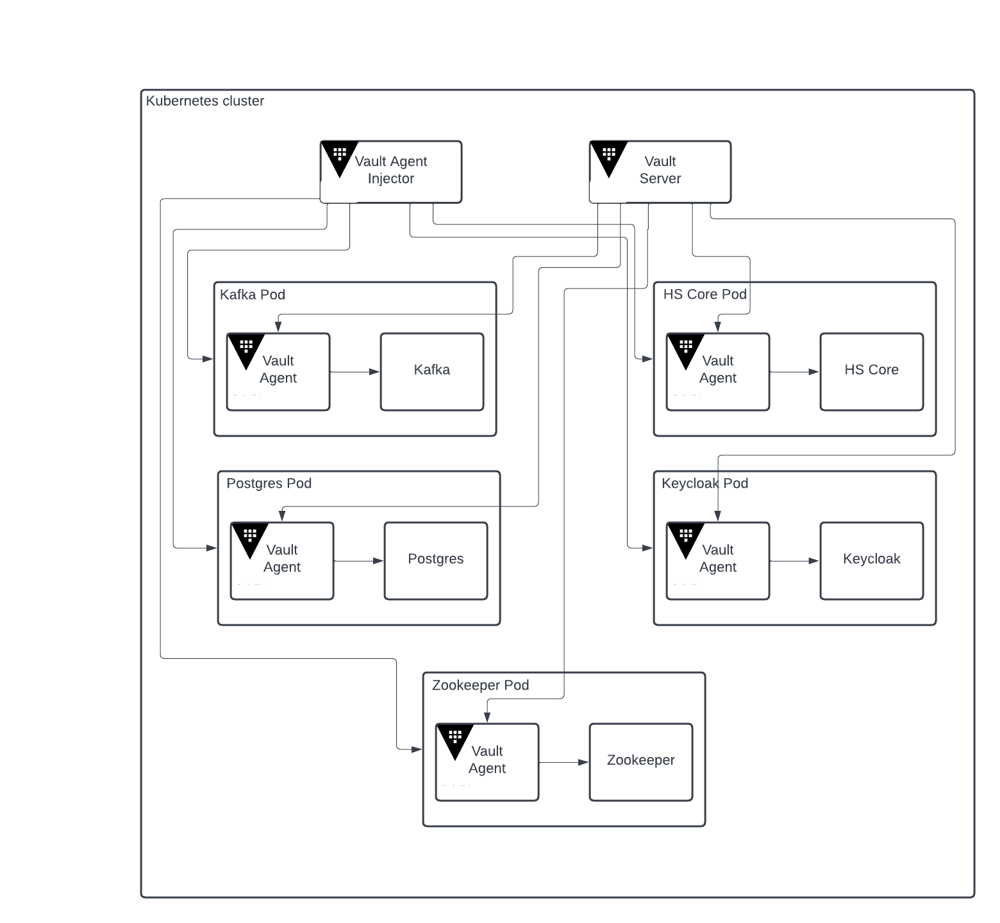

# Horizon Stream with Vault


This takes the existing Horizon Stream and uses Hashicorp Vault to store
secrets instead of using kubernetes secrets.



Vault connects into existing pods that require secret access through an agent. The agent
is automatically deployed by the
agent injector when specific annotations are found on the pod. The agent can be
used to inject secrets retrieved from the vault into containers through files and
environment variables. This provides a simple migration for containers already
written to work with kubernetes secrets.
\
Two deployment methods were scripted and are available. The vault and all its components can
be deployed directly into the cluster along with horizon stream. This is the
default and is pictured above. Kubernetes authentication is used to authenticate
with the vault, allowing access to secrets based on namespace and service account used in the pod.
\
Alternatively, a separate script is available
to deploy the vault outside of the cluster. This option deploys vault locally, but
could be used to connect multiple clusters to a single vault being run separately.
In this case, the agent injector and agent are still deployed in the cluster to
interface with the pods, but a separate external service and endpoint are defined
to connect out to the vault. The vault is configured to interface with kubernetes
and will still use the same kubernetes authentication.

### Instructions 

#### Full Deployment in Kubernetes
Ensure kubectl is connected to the desired cluster and namespace. The provided vault
script will run helm to install the vault components, and will then configure it to contain
the needed horizon stream secrets.
```
cd vault
./setupK8sVault.sh
cd ..
skaffold dev
```

#### Local Vault, External to Kubernetes
Ensure kubectl is connected to the desired cluster and namespace.
The external-vault yaml must be edited to have the IP address changed
to that of where the vault server will be running (e.g. the local host),
but must be an IP that is reachable from within the cluster.
\
The vault script will run helm to install only the vault agent injector into the cluster.
It will also startup and configure a local vault server.
\
Before running skaffold to deploy the horizon stream components, some
changes must be made to the yaml definitons to allow setting two additional
environment variables on any pods using vault. This will ensure their agent
directs vault queries through the external service definition.
```
cd vault
vi external-vault.yaml
./setupLocalVault.sh
cd ..
# In vi, or your editor of choice, remove the commented out sections
# to set the VAULT_ADDR and VAULT_TOKEN on the various deployments
# (postgres, zookeeper, horizon stream core, kafka and keycloak)
vi dev/kubernetes.kafka.yaml
skaffold dev
```
